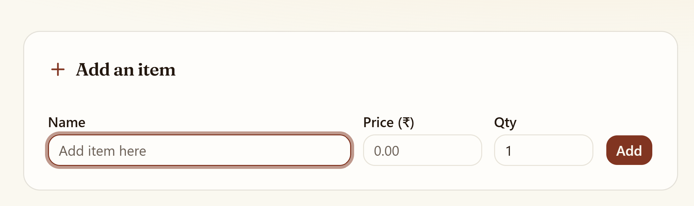
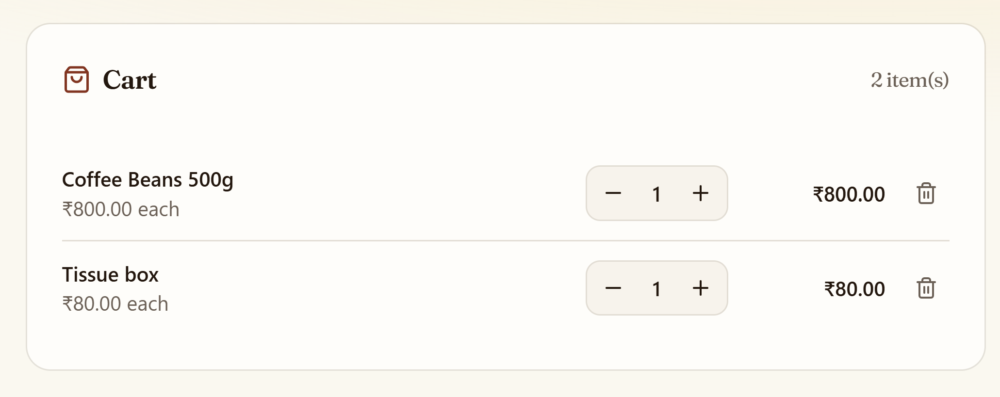
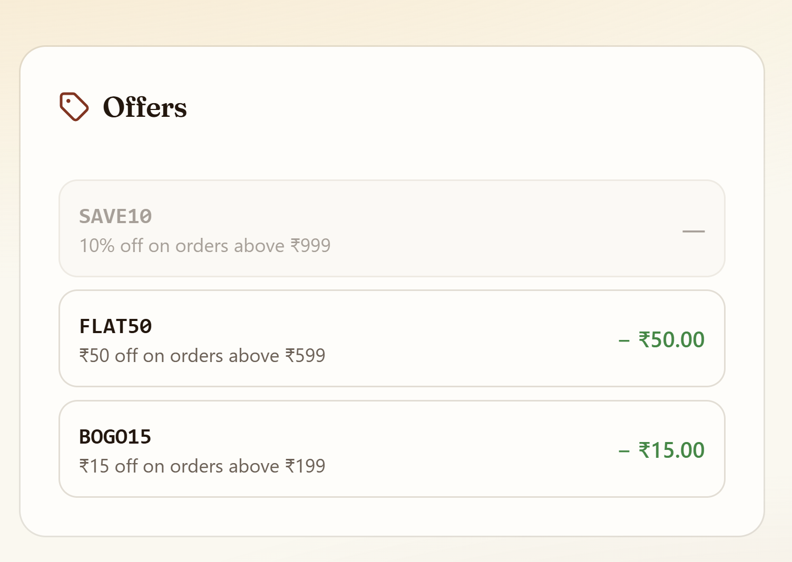
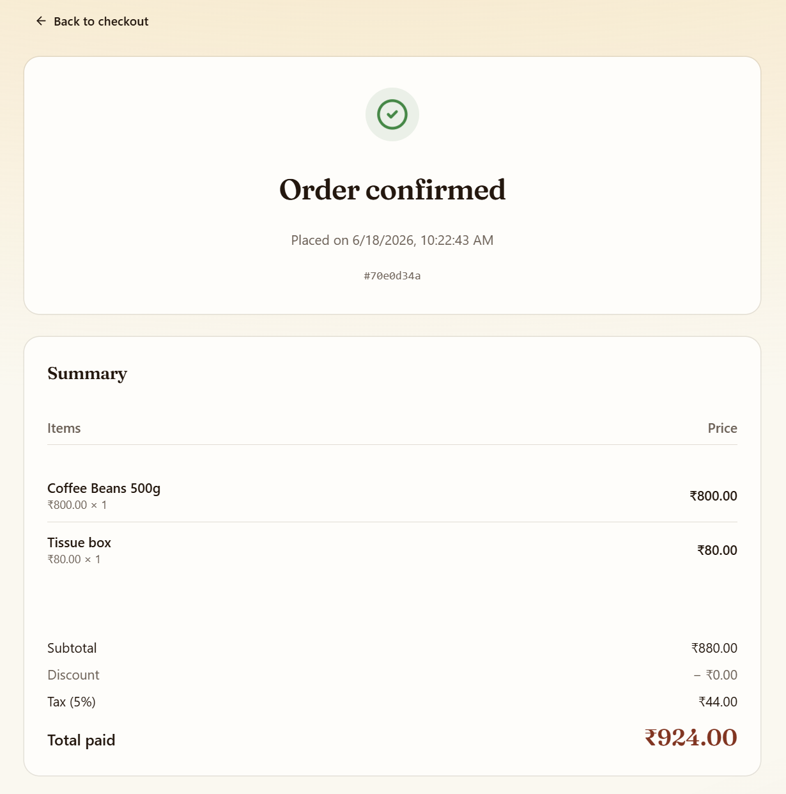
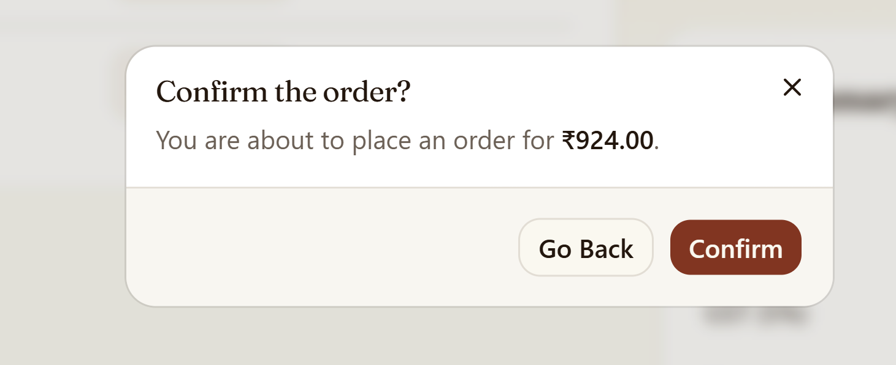
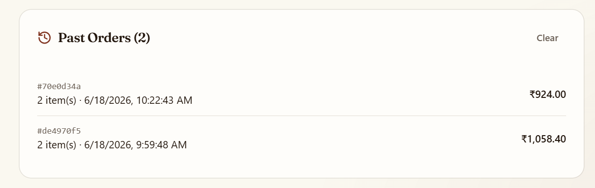
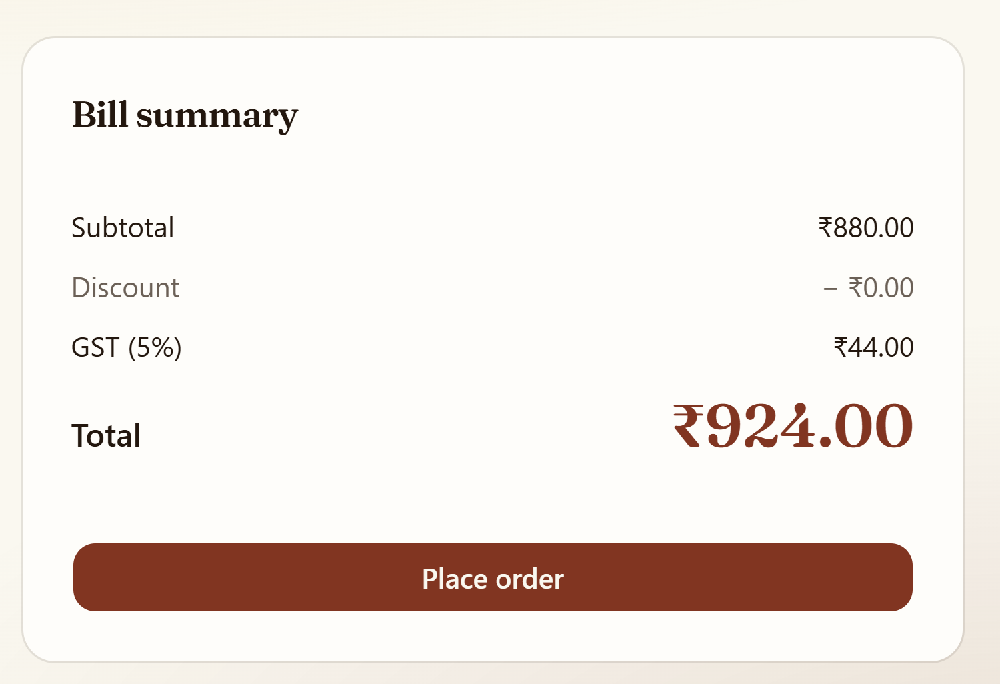

# Checkout Billing System

A modern and responsive checkout billing application built with **React, TypeScript, Vite, Tailwind CSS, and shadcn/ui**. The application allows users to add items to a cart, apply discount offers, calculate taxes automatically, place orders, and maintain an order history with a clean and intuitive user interface.

## Features

### Cart Management

* Add products with name, price, and quantity
* Increase or decrease item quantity
* Remove items from the cart
* Automatic subtotal calculation

### Smart Offers & Discounts

* **SAVE10** – 10% off on orders above ₹999
* **FLAT50** – ₹50 off on orders above ₹599
* **BOGO15** – ₹15 off on orders above ₹199
* Invalid offers are automatically disabled and displayed in grey
* Applied coupon is highlighted and displayed in the bill summary

### Billing Engine

* Real-time subtotal calculation
* Automatic discount calculation
* 5% tax calculation
* Instant final bill generation

### Order Confirmation

* Confirmation popup before placing an order
* Detailed order summary page after successful checkout
* Animated success tick indicator
* Displays purchased items, pricing details, taxes, discounts, and final amount

### Order History

* Stores previous orders using Local Storage
* View past orders with timestamps and total amount
* Clear order history when required

### User Experience

* Fully responsive design
* Modern UI using shadcn/ui components
* Toast notifications for user actions
* Clean invoice-style order summary

---

## Tech Stack

### Frontend

* React
* TypeScript
* Vite

### UI & Styling

* Tailwind CSS v4
* shadcn/ui
* Radix UI
* Lucide React Icons

### State Management

* React Hooks (`useState`, `useMemo`, `useEffect`)

### Data Persistence

* Browser Local Storage

---

## Project Structure

```text
src/
│
├── components/
│   └── ui/
│       ├── badge.tsx
│       ├── button.tsx
│       ├── card.tsx
│       ├── dialog.tsx
│       ├── input.tsx
│       ├── label.tsx
│       ├── separator.tsx
│       └── sonner.tsx
│
├── lib/
│   └── utils.ts
│
├── App.tsx
├── main.tsx
└── index.css
```

---

## Installation

Clone the repository:

```bash
git clone https://github.com/<your-username>/checkout-billing-system.git
cd checkout-billing-system
```

Install dependencies:

```bash
npm install
```

Start the development server:

```bash
npm run dev
```

Open:

```text
http://localhost:5173
```

---

## Build for Production

```bash
npm run build
```

Preview production build:

```bash
npm run preview
```

---

## Deployment

### Vercel

1. Push the project to GitHub
2. Import the repository into Vercel
3. Vercel automatically detects the Vite framework
4. Deploy

Build Settings:

```text
Build Command: npm run build
Output Directory: dist
Install Command: npm install
```

---

## Coupon Logic

| Coupon | Condition           | Discount |
| ------ | ------------------- | -------- |
| SAVE10 | Order value ≥ ₹1000 | 10% off  |
| FLAT50 | Order value ≥ ₹600  | ₹50 off  |
| BOGO15 | Order value ≥ ₹200  | ₹15 off  |

---

## Future Enhancements

* PDF Invoice Generation
* Customer Information Management
* Inventory Tracking
* Backend Integration
* User Authentication
* Admin Dashboard
* Sales Analytics
* Database Storage

---


## 📸 Application Preview

### Add Item


### Cart


### Offers


### Bill Summary


### Order Confirmation


### Past Orders


### Complete Bill


---

## Author

**Yogananda G**

Built as a modern checkout and billing system to demonstrate React, TypeScript, state management, UI design, and frontend application development skills.
